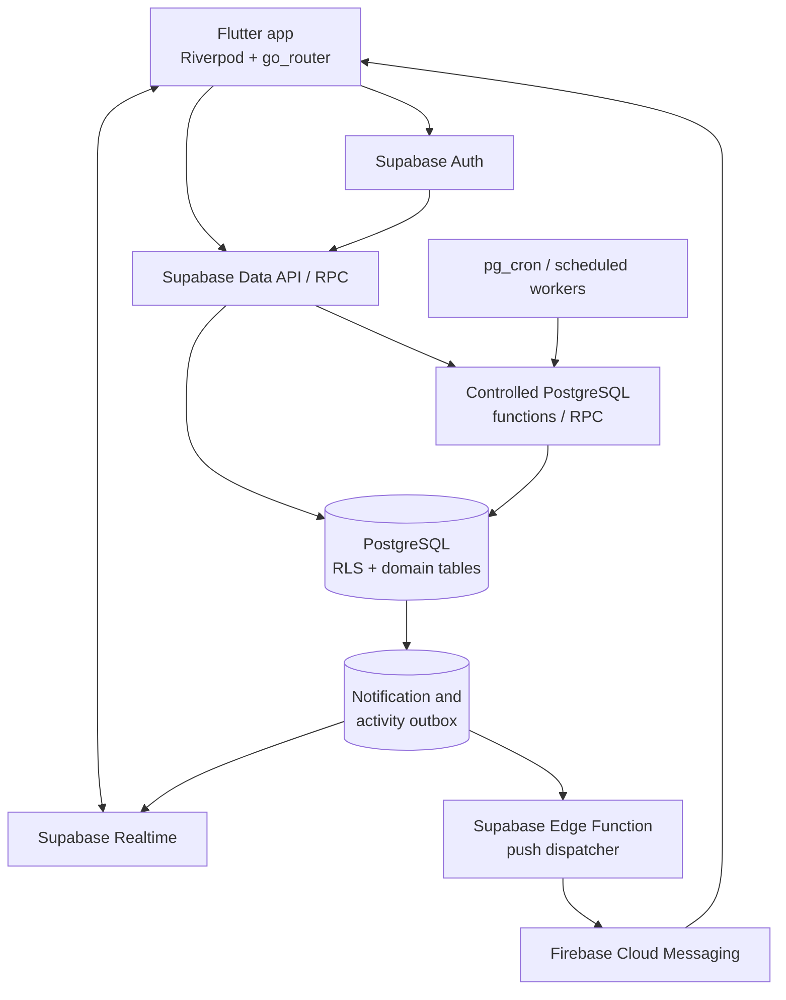
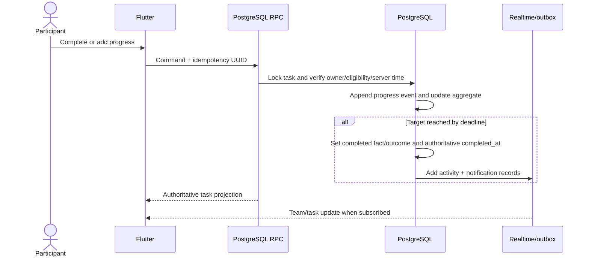

# Production Architecture

## 1. Scope and Authority

This document translates [PRODUCT_SPEC.md](PRODUCT_SPEC.md) and BR-001–BR-159 in [BUSINESS_RULES.md](BUSINESS_RULES.md) into a production-safe technical design. It does not define SQL, RLS policies, or deployment configuration. PostgreSQL is the authoritative domain boundary; Flutter is an untrusted presentation client.

## 2. System Overview



The system is a modular monolith: one Flutter client, Supabase Auth/API/Realtime, one PostgreSQL domain model, scheduled database work, and one small external-delivery boundary for FCM. No microservices or external broker are required for MVP.

## 3. Major Technical Decisions

| Decision | Why | Rejected alternative |
|---|---|---|
| PostgreSQL functions own sensitive transitions | Authorization, server time, locks, constraints, ledger effects, audit, and outbox events commit atomically | Direct client table updates can bypass invariants |
| Hybrid open-time task materialization | A scheduled pass creates newly opened periods and read-time catch-up repairs gaps; no unopened future task can become stale after an effective-dated change | Pure lazy generation risks missing deadlines; future pre-generation conflicts with changes that apply to unopened periods |
| Immutable progress events plus a transactional aggregate on each task | Events prove timing; the aggregate keeps mobile reads simple and cheap | Events-only reads repeatedly sum history; aggregate-only storage loses evidence |
| Signed ledger amounts: positive increases debt, negative reduces debt | `SUM(amount)` directly derives debt and preserves one append-only stream | Separate debit/credit columns allow invalid dual values and add query complexity |
| Separate task completion fact from product outcome | `EXCUSED` remains a visible non-completion, while late acknowledged completion can exist without a fabricated timestamp | One ambiguous status cannot faithfully represent BR-044 and BR-143–BR-149 |
| Effective-dated challenge timezone rows plus frozen task windows | Future timezone changes do not reinterpret history (BR-128) | Updating one challenge timezone column would silently alter derived historical periods |
| Transactional notification outbox | Domain commit is independent from FCM availability and delivery is retryable | Sending push inside a domain transaction couples correctness to an external service |
| Recompute ranking from facts; cache only if measured need appears | Preserves explainability and prevents score drift | A mutable score as source of truth is not historically trustworthy |

## 4. Client Responsibilities and Trust Boundary

Flutter may render authorized state, collect input, call RPCs, show connectivity/conflict states, cache non-authoritative presentation data, and subscribe to permitted Realtime changes. Riverpod should expose explicit loading/data/error states; `go_router` may hide unavailable routes for UX but never serves as authorization.

Flutter must not decide completion validity or `completed_at`, close periods, create penalties, calculate authoritative debt, approve payments/excuses, establish correction truth, or persist ranking facts. Client-generated timestamps and cached role/debt/status values are hints only. Every sensitive command is revalidated against current database state and `clock_timestamp()`/`now()` within the transaction.

## 5. Authentication and Authorization

Supabase Auth supplies immutable user identity. `profiles` holds application-facing identity; `challenge_members` controls participation; `challenge_admins` independently grants the full MVP admin role. An admin can also have a membership row, but neither row implies the other (BR-006–BR-010).

RLS protects reads and blocks direct writes to authoritative fields. Participant-safe RPCs verify the authenticated user owns the target membership/task. Admin RPCs verify an active challenge admin row. Privileged participant-specific operations also resolve the target participant/financial beneficiary and require a different active admin for excuse/payment review, beneficial penalty/debt reduction, and beneficial historical correction (BR-150–BR-159). These checks run server-side after locking; UI hiding is only a usability aid. Service-role credentials exist only in trusted server/Edge Function environments, never Flutter.

A participating admin still uses participant RPCs to complete current tasks or submit requests and may perform audited challenge-wide administration. If they are the only active admin, their own excuse/payment request remains pending and a beneficial waiver/correction cannot execute until another active admin is added.

## 6. Server-Side Mutation Boundaries

Each public RPC accepts a caller-generated UUID idempotency key where retry is plausible. The database records or constrains that key in the affected event/source row. Authorization and state checks occur again after acquiring locks.

| Logical operation | Caller | Validation and atomic effects | Audit and idempotency |
|---|---|---|---|
| `complete_task(task_id, request_id)` | Owning participant | Lock task; verify membership, eligible `PENDING`, server time `<= deadline_at`, and boolean/occurrence semantics; write progress/completion fact, authoritative time, activity, notification | Unique progress/completion request; repeated call returns established result without duplicate activity |
| `record_task_progress(task_id, amount, request_id)` | Owning participant | Lock task; verify window/type/positive amount; derive challenge-local occurrence date from server time; append event; update aggregate; complete when target reached | Unique request ID; weekly counted-occurrence uniqueness; event timestamp is evidence |
| `submit_excuse_request(challenge_id, range, reason, habits, request_id)` | Participant | Verify active membership, valid range/reason, nonempty owned challenge habits; create request and requested-habit rows; enqueue admin notice | One request per idempotency key; request creation is auditable |
| `review_excuse_request(request_id, decision, approved_scope, request_key)` | Different challenge admin | Lock request; verify `PENDING`, admin role, reviewer != participant, approved scope is a subset; create task excuse effects; apply pre-deadline coverage or late corrections and linked waivers | Terminal state compare-and-set; one effect per request/task; audit requested vs approved scope |
| `submit_payment_request(challenge_id, amount, request_id)` | Participant | Verify membership, currency, positive amount, amount <= locked/derived challenge debt, and no pending request; create `PENDING` request and admin notification | Partial unique pending index plus idempotency key |
| `approve_payment_request(payment_request_id, request_id)` | Different active admin when requester is an admin participant | Lock request and finance scope; verify pending, reviewer != participant, and current debt >= amount; append `PAYMENT_CONFIRMED`; mark approved; audit; notify | Unique ledger source and terminal compare-and-set prevent double approval |
| `reject_payment_request(payment_request_id, reason, request_id)` | Different active admin when requester is an admin participant | Lock pending request; verify reviewer != participant; mark rejected; record reviewer/time/reason; notify; do not touch ledger | Terminal compare-and-set and idempotency key |
| `admin_correct_task(task_id, outcome, evidence_id, reason, request_id)` | Challenge admin; different active admin for a self-benefiting target | Lock task; verify evidence/timing and whether transition improves target participant's outcome; prohibit beneficial self-correction; append correction; update projection; emit audit/outbox | Correction is append-only; unique request; actor/participant recorded; never fabricates `completed_at` |
| `waive_penalty(ledger_entry_id, amount, reason, request_id)` | Active admin other than the financial beneficiary | Lock source penalty/beneficiary finance scope; verify challenge/currency/remaining amount and actor != beneficiary; append linked negative waiver; audit | Unique request/source prevents duplicate compensation; never alters timing status |
| `change_membership_status(membership_id, status, effective_at, reason, request_id)` | Challenge admin | Lock membership; validate transition; close future eligibility; neutralize no-longer-actionable pending tasks; audit and notify | Unique request; task effects use unique correction/source references |
| `create_or_version_habit_rule(habit_id, rule, effective_at, request_id)` | Challenge admin | Validate schedule/target/window/penalty/reminders and non-overlap; insert version, never overwrite historical version | Unique habit/effective instant and request; audit old/current/new relationship |
| `change_challenge_timezone(challenge_id, timezone, effective_at, request_id)` | Challenge admin | Require future/unopened-period boundary; close prior timezone version and insert next; do not change materialized tasks | Non-overlapping effective range; audit |
| `pause_challenge(...)` / `resume_challenge(...)` | Challenge admin | Record pause interval/state; neutralize pending tasks at pause; prevent/resume materialization; audit/outbox | State compare-and-set and unique request |
| `materialize_open_tasks(batch_size)` | Trusted scheduler; safe read-time catch-up wrapper | Select only periods already open; resolve effective timezone/rule/membership/pause; insert frozen task rows | Unique task period identity makes scheduler and catch-up races converge |
| `close_due_tasks(batch_size)` | Trusted scheduled worker | Claim due tasks with row locks; resolve excuse/weekly outcome; append penalty when needed; emit events/outbox | `FOR UPDATE SKIP LOCKED`, unique task penalty source, safe repeated batches |
| `dispatch_notification_outbox(batch_size)` | Trusted Edge Function/scheduler | Claim due per-device jobs; recheck token/preferences; call FCM; record delivered/retry/dead state | `SKIP LOCKED` claim, unique notification/device/channel, bounded backoff |

Edge Functions are reserved for operations requiring external systems, principally consuming the push outbox and calling FCM. They do not independently decide domain outcomes.

## 7. Task Generation Strategy

Use a hybrid strategy:

1. A scheduled, challenge-batched materializer creates concrete daily/weekly `task_instances` once their period has opened; it never creates unopened future periods.
2. App/admin reads may invoke a safe catch-up function that materializes any missing currently relevant periods before returning results.
3. A unique period identity makes both paths idempotent.

The materializer selects active challenges, the timezone version effective at each period opening, active memberships, active habits, and the habit rule effective at `opens_at`. It creates one task per eligible participant/habit/period and freezes rule version, local period dates, timezone name, UTC `opens_at`/`deadline_at`, original target, penalty mode/amount, and unit. It skips periods before join, after deactivation/removal, and while paused. Approved excuses are linked as effects; they do not delete the task. Because creation occurs only at or after `opens_at`, future rule and timezone versions remain authoritative until the period actually opens.

This avoids one cron job per user/habit and preserves reproducibility without a future-task invalidation workflow. The scheduler processes all challenges in bounded batches, while read-time catch-up prevents a delayed worker from leaving Today views empty. Once created, task rows are historical and are never rewritten by later configuration.

## 8. Deadline Processing

A frequent scheduled worker processes due tasks in bounded batches:

1. Select `PENDING` tasks where server time is after `deadline_at`, ordered by deadline, using `FOR UPDATE SKIP LOCKED`.
2. Recompute the current aggregate from trusted state when necessary and load approved excuse effects.
3. Daily/quantity/duration: close as completed only if authoritative evidence reached target by deadline; otherwise map covered non-completion to `EXCUSED`, uncovered non-completion to `MISSED`.
4. Weekly: calculate eligible target, counted occurrences, and missing units after the weekly close.
5. For a miss, append one `PENALTY` using task ID as unique source. For an excuse, create no penalty.
6. Commit outcome projection, immutable event/audit where required, activity, and notification/outbox records together.

If the worker crashes, another run safely resumes. Row locks resolve races with participant completion: whichever transaction locks first revalidates server time and state; the unique task outcome and ledger source prevent two terminal effects.

## 9. Financial Architecture and Payment Workflow

`ledger_entries` is the challenge-scoped financial source of truth. Positive signed amounts increase debt (`PENALTY`; positive `ADMIN_ADJUSTMENT`), while negative amounts reduce it (`PAYMENT_CONFIRMED`, `WAIVER`; negative adjustment). Current debt is `SUM(amount)` for challenge/participant; historical penalty total and total paid filter by entry type. A database view may centralize these formulas. A cached balance is unnecessary for MVP and, if introduced later, is explicitly rebuildable—not authoritative.

Ledger rows are immutable except narrowly operational, non-financial metadata if ever required. Corrections append linked entries. Challenge currency is copied to every entry and locked after the first entry (BR-131–BR-132).

```mermaid
sequenceDiagram
    actor P as Participant
    participant RPC as PostgreSQL RPC
    participant DB as PostgreSQL
    actor A as Different active admin when required
    participant O as Notification outbox

    P->>RPC: submit_payment_request(challenge, amount, key)
    RPC->>DB: Validate debt; insert PENDING request
    DB->>O: Insert admin in-app/outbox event
    A->>RPC: approve_payment_request(request, key)
    RPC->>DB: Lock request; verify reviewer != participant; rederive debt
    DB->>DB: Append PAYMENT_CONFIRMED + mark APPROVED + audit
    DB->>O: Insert participant notification
    RPC-->>A: Committed result
```

If debt changed and amount is no longer valid, approval returns a conflict and changes neither request nor ledger (BR-067). A different active admin may then reject it when the requester is an admin participant. Competing approvals serialize on the payment row; the unique ledger source guarantees one confirmed entry. A sole admin's own payment request remains pending until another active admin exists.

## 10. Excuse Architecture

An excuse request holds participant, challenge, authoritative requested interval, reason, and review state. Child rows preserve the requested habit set and final approved subset. The review RPC enforces independent review and creates `task_excuse_effects` for concrete covered obligations; weekly effects include explicit excused units.

Pre-approved coverage leaves an open task pending. At deadline, incomplete covered work becomes visible `EXCUSED`, with no penalty and no completion credit. If completed by the deadline, it remains `COMPLETED_ON_TIME`. A late approval appends a task correction; if a penalty already exists, the same transaction appends a linked `WAIVER`. The penalty is never deleted. Statistics read excuse effects/reasons separately from completed and unexcused counts.

### Late excuse approval sequence

```mermaid
sequenceDiagram
    actor P as Participant
    actor A as Different admin
    participant RPC as PostgreSQL RPC
    participant DB as PostgreSQL
    participant O as Notification outbox

    P->>RPC: submit_excuse_request(range, habits, reason, key)
    RPC->>DB: Insert PENDING request and requested habits
    A->>RPC: review_excuse_request(APPROVE, subset, key)
    RPC->>DB: Verify admin and A != P; lock request
    DB->>DB: Add task effects; append correction if already MISSED
    opt Existing penalty
        DB->>DB: Append linked WAIVER
    end
    DB->>DB: Mark APPROVED + audit old/new state
    DB->>O: Insert participant notification
```

A sole admin's own request remains pending until a different full admin exists. No moderator or voting mechanism is introduced.

## 11. Successful Completion Sequence



Flutter celebrates only after the authoritative response (or reconciled Realtime event), never merely after a local tap.

## 12. Ranking Architecture

Ranking is a query over closed `task_instances` and immutable evidence:

- denominator: closed eligible tasks, excluding `EXCUSED`/neutral tasks;
- numerator: `COMPLETED_ON_TIME` tasks only;
- primary ordering: completion rate descending;
- tie-breaker: mean normalized authoritative completion time ascending;
- exact ties share rank.

Late acknowledgement without authoritative pre-deadline evidence has no `completed_at` eligible for timing (BR-143–BR-149). Weekly tasks use the authoritative timestamp when the eligible target was reached. Queries expose completed, unexcused, and excused counts separately. Start with database views/functions; introduce a refreshable materialized view only after measured query cost warrants it. Any cache must be derivable and invalidated/refreshed after relevant corrections.

## 13. Notifications and Realtime

Domain transactions write an authoritative in-app `notifications` row and, when push is applicable, one `notification_outbox` row per active device token. A scheduled Edge Function claims pending outbox rows, rechecks token/preference validity, calls FCM, and records success or retry state. Exponential backoff and a maximum-attempt dead state prevent hot loops; operators can inspect/replay dead entries. Unique event/recipient/device/channel keys prevent duplicate logical notices and isolate partial multi-device failures.

Supabase Realtime may update authorized app-open views for task state, team activity, payment status, excuse status, and in-app notifications. Realtime publication should expose narrow tables/views and RLS-filtered rows. It is not background push and is not the authoritative record.

Notification failure never rolls back a committed completion, penalty, payment, excuse, or correction. Important in-app history already exists; push safely retries.

## 14. Offline Behavior

Flutter may retain non-authoritative form input and display offline/unsynced states. A completion or progress action is accepted only when the server commits it by `deadline_at`. A later retry cannot carry a device timestamp to backdate acceptance. Conflict responses must replace optimistic UI with the authoritative task state and offer an appropriate next step; only audited admin correction can recognize historical completion.

## 15. Error, Conflict, and Retry Model

- Duplicate tap/network retry with the same idempotency key returns the prior outcome.
- A retry with a new key still meets domain unique constraints and cannot repeat terminal effects.
- Serialization/state conflicts return a typed conflict with current authoritative state; Flutter refreshes instead of silently overwriting.
- Validation and permission failures are explicit and non-retryable without changed input/authority.
- Transient database/network failures are retryable with bounded backoff.
- Transactions are all-or-nothing across state, ledger, audit, activity, and outbox effects.
- Push failures remain isolated in the outbox and never alter domain truth.

## 16. Observability and Audit

Use structured server logs with correlation/request ID, operation name, authenticated actor ID, challenge ID, result class, duration, and safe error code. Never log passwords, tokens, free-form sensitive reason text, or service credentials. Monitor failed scheduled batches, outbox backlog/dead deliveries, RPC error rates, and unusual authorization failures.

`audit_log` is append-only evidence for administrative and sensitive actions, storing actor, action, target, reason where required, and structured old/new snapshots. It supplements—not replaces—business event tables. Retain enough linkage to trace task → penalty → waiver, payment request → confirmed payment, and excuse request → task effects/corrections.

## 17. Known Technical Risks

- Timezone/DST conversion at materialization boundaries can create duplicate or missing periods; frozen UTC windows and period uniqueness need boundary tests.
- Deadline/completion races require row locks and inclusive deadline semantics.
- Broad Realtime publication or incorrect RLS could leak private challenge data.
- Outbox growth and poison FCM tokens need retention and deactivation policies.
- Large ranking/history queries may later need derived materialization, but premature caches risk drift.
- Append-only finance/audit needs privileged mutation denial, backups, and operational review.
- A sole participating admin cannot resolve their own excuse/payment request or execute a self-benefiting waiver/correction until another admin is added; this is intentional product behavior.
