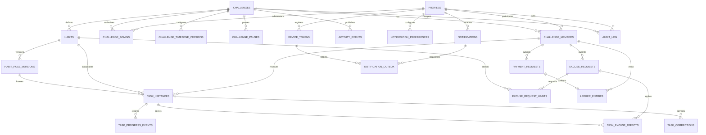

# PostgreSQL Data Model

## 1. Scope and Conventions

This is a logical PostgreSQL design for the architecture in [ARCHITECTURE.md](ARCHITECTURE.md) and BR-001–BR-149 in [BUSINESS_RULES.md](BUSINESS_RULES.md). It is not a migration. Names and exact enum implementation may be refined when SQL is written, but invariants must not change silently.

Conventions:

- Use UUID primary keys generated server-side. `profiles.id` equals the Supabase Auth user UUID.
- Use `timestamptz` for authoritative instants and database-generated timestamps; never accept client timestamps as truth.
- Use `date`/`time` only for explicit challenge-local schedule concepts, paired with a frozen IANA timezone name.
- Monetary values use `numeric(18,2)` and ISO 4217 `char(3)` currency codes; no floating point.
- Important commands carry a UUID `request_id` with a uniqueness constraint for idempotency.
- Historical/event/ledger/audit rows are append-only. Current workflow projections are mutable only through controlled functions.
- Enable RLS on every application table. Internal tables deny all client access unless an explicit read policy is documented.

Recommended logical enums include challenge status (`DRAFT`, `ACTIVE`, `PAUSED`, `ENDED`), member status (`ACTIVE`, `INACTIVE`, `REMOVED`), habit type, period kind, task outcome, excuse/payment status, excuse reason, penalty mode, ledger type, delivery mode/status, and audit action. Prefer constrained enums or lookup checks over arbitrary text.

## 2. Entity Relationship Diagram



## 3. Auth and People

### `profiles`

- **Purpose:** Application profile for a Supabase Auth identity; not a password store.
- **Columns:** `id uuid`, `display_name text`, optional `username text`, `must_change_password boolean`, `created_at timestamptz`, `updated_at timestamptz`.
- **Keys:** PK `id`; FK `id -> auth.users.id`.
- **Constraints:** case-insensitive unique username when present; nonblank display name/username.
- **Indexes:** username uniqueness is sufficient initially.
- **Mutability:** Profile fields may change through controlled profile/provisioning flows; identity and creation time are immutable. Passwords remain exclusively in Supabase Auth.
- **Authority/RLS:** Timestamps are server-generated. Users read/update allowed own presentation fields; admins receive only challenge-appropriate profile visibility. No client can clear first-login enforcement arbitrarily.

## 4. Challenge and Authorization

### `challenges`

- **Purpose:** Stable challenge identity and current lifecycle projection.
- **Columns:** `id`, `name`, `description`, `status`, `start_date date`, `end_date date null`, `currency_code char(3) default 'UZS'`, `created_by`, `created_at`, `updated_at`.
- **Keys:** PK `id`; FK `created_by -> profiles.id`.
- **Constraints:** nonblank name; `end_date >= start_date`; valid uppercase currency; currency update rejected after any ledger entry; valid status transition.
- **Indexes:** `(status, start_date)` for materialization; no speculative name index.
- **Mutability:** Name/description and controlled lifecycle projection may change. Identity, creator, and established financial currency are immutable as specified.
- **Authority/RLS:** Server timestamps. Members may read their challenge; active admins manage only through RPC.

### `challenge_timezone_versions`

- **Purpose:** Effective-dated IANA timezone history without reinterpreting task windows (BR-128).
- **Columns:** `id`, `challenge_id`, `timezone_name`, `effective_from timestamptz`, `effective_to timestamptz null`, `created_by`, `created_at`, `request_id`.
- **Keys:** PK `id`; FKs to `challenges` and `profiles`.
- **Constraints:** valid timezone name; `effective_to > effective_from`; exclusion constraint prevents overlapping `[effective_from,effective_to)` ranges per challenge; unique `(challenge_id, effective_from)` and `request_id`.
- **Indexes:** `(challenge_id, effective_from desc)`.
- **Mutability:** Append a future version and close the prior range transactionally; never rewrite a version used by a task.
- **Authority/RLS:** Admin-readable; writes only through timezone RPC.

### `challenge_members`

- **Purpose:** Participation and effective eligibility, separate from admin authorization.
- **Columns:** `id`, `challenge_id`, `user_id`, `status`, `joined_at`, `ended_at null`, `status_reason null`, `created_at`, `updated_at`.
- **Keys:** PK `id`; FKs to challenge/profile.
- **Constraints:** `ended_at >= joined_at`; one active membership per `(challenge_id,user_id)` via partial unique index; no physical delete after referenced history.
- **Indexes:** `(user_id,status)`, `(challenge_id,status)`, `(challenge_id,joined_at,ended_at)`.
- **Mutability:** Status/end time change only through membership RPC with audit; historical row persists.
- **Authority/RLS:** User reads own membership; challenge members/admins receive permitted roster data; client cannot change status.

### `challenge_admins`

- **Purpose:** Full MVP challenge-admin authority independent from participation.
- **Columns:** `id`, `challenge_id`, `user_id`, `granted_at`, `revoked_at null`, `granted_by`, `created_at`.
- **Keys:** PK `id`; FKs to challenge/profile for user and grantor.
- **Constraints:** `revoked_at > granted_at`; one active grant per `(challenge_id,user_id)` via partial unique index. Activation requires at least one admin, enforced by lifecycle RPC rather than a row check.
- **Indexes:** `(user_id,challenge_id) where revoked_at is null`, `(challenge_id) where revoked_at is null`.
- **Mutability:** Grant rows are append-oriented; revocation sets `revoked_at` through an audited RPC. Do not delete referenced grants.
- **Authority/RLS:** Active admins may read the challenge's grants; no client direct writes. Role does not require a membership row.

### `challenge_pauses`

- **Purpose:** Audited pause intervals driving neutral task outcomes.
- **Columns:** `id`, `challenge_id`, `starts_at`, `ends_at null`, `reason`, `created_by`, `ended_by null`, `created_at`, `updated_at`, `request_id`.
- **Keys:** PK; FKs to challenge/profile.
- **Constraints:** `ends_at > starts_at`; nonblank reason; non-overlapping pause ranges per challenge; unique request ID.
- **Indexes:** `(challenge_id, starts_at desc)`, partial `(challenge_id) where ends_at is null`.
- **Mutability:** Open pause may receive its authoritative end; completed intervals are immutable. Start/resume and affected task corrections are transactional/audited.
- **Authority/RLS:** Members may read; only admin RPC mutates.

## 5. Habits and Rule Versions

### `habits`

- **Purpose:** Stable challenge-owned habit identity.
- **Columns:** `id`, `challenge_id`, `name`, `description`, `habit_type`, `is_active`, `created_by`, `created_at`, `updated_at`.
- **Keys:** PK; FKs to challenge/profile.
- **Constraints:** nonblank name; supported habit type; habit type cannot change after task history exists.
- **Indexes:** `(challenge_id,is_active)`.
- **Mutability:** Presentation metadata/current activity may change; no physical deletion after references.
- **Authority/RLS:** Members read challenge habits; admin RPC controls writes.

### `habit_rule_versions`

- **Purpose:** Immutable effective-dated schedule, target, penalty, and reminder terms.
- **Columns:** `id`, `challenge_id`, `habit_id`, `effective_from`, `effective_to null`, `period_kind`, `days_of_week smallint[]`, `target_value numeric`, `unit text`, `opens_local_time time`, `deadline_local_time time`, `penalty_mode`, `penalty_amount numeric(18,2)`, `reminder_start_local time null`, `reminder_end_local time null`, `reminder_interval_minutes int null`, `default_message_template text`, `admin_message_template text null`, `created_by`, `created_at`, `request_id`.
- **Keys:** PK; FKs to challenge/habit/profile. A composite relationship must ensure habit belongs to challenge.
- **Constraints:** unique `(habit_id,effective_from)`; no overlapping effective ranges; target positive; weekday values 1–7; penalty nonnegative; MVP weekly penalty mode `PER_MISSING_UNIT`; reminder interval positive and reminder fields internally complete; generated UTC deadline must be after opening.
- **Indexes:** `(habit_id,effective_from desc)`, `(challenge_id,effective_from,effective_to)`.
- **Mutability:** Insert-only except closing an unused/open effective range as part of version creation. Versions referenced by tasks are immutable.
- **Authority/RLS:** Members read effective/historical rules allowed by product; admin RPC creates versions.

## 6. Obligations, Progress, and Corrections

### `task_instances`

- **Purpose:** Concrete historical obligation for one membership, habit, and daily/weekly period.
- **Columns:** `id`, `challenge_id`, `challenge_member_id`, `habit_id`, `habit_rule_version_id`, `period_kind`, `period_start_date`, `period_end_date`, `timezone_name`, `opens_at`, `deadline_at`, frozen `habit_type`, `original_target`, `unit`, `penalty_mode`, `penalty_amount`, cached `current_progress`, `was_completed boolean`, `outcome_status`, `authoritative_completed_at null`, `created_at`, `updated_at`.
- **Keys:** PK; FKs to challenge/member/habit/rule. Composite FKs/validation ensure all parents share the challenge.
- **Constraints:** unique `(challenge_member_id,habit_id,period_kind,period_start_date)`; `deadline_at > opens_at`; targets positive; progress nonnegative; outcome/fact consistency:
  - `COMPLETED_ON_TIME` requires `was_completed=true`, nonnull `authoritative_completed_at <= deadline_at`;
  - `COMPLETED_LATE` requires `was_completed=true` and permits null authoritative completion time or a time after deadline;
  - `PENDING`, `MISSED`, and `EXCUSED` require `was_completed=false`; `EXCUSED` never means completed.
- **Indexes:** participant Today `(challenge_member_id,outcome_status,opens_at,deadline_at)`; history `(challenge_member_id,period_start_date desc)`; admin monitor `(challenge_id,period_start_date,outcome_status,deadline_at)`; missed `(challenge_id,outcome_status,deadline_at) where outcome_status='MISSED'`; ranking `(challenge_id,deadline_at,outcome_status)`.
- **Mutability:** Frozen schedule/rule fields never change. Current progress/outcome projection changes only in transactional RPC/worker; events/corrections preserve history.
- **Authority/RLS:** Participant reads own tasks; authorized team/admin views are scoped. Clients cannot directly update progress, status, target, or timestamps.

The separate `was_completed`, `outcome_status`, and authoritative timestamp preserve product truth. Product status maps directly from `outcome_status`; the extra fact prevents `EXCUSED` from being interpreted as completion and permits `COMPLETED_LATE` acknowledgment without fabricated `completed_at` (BR-143–BR-149).

### `task_progress_events`

- **Purpose:** Immutable authoritative progress and completion evidence.
- **Columns:** `id`, `task_instance_id`, `actor_id`, `event_kind`, `amount numeric`, `occurrence_local_date date null`, `accepted_at timestamptz`, `request_id`, optional safe `metadata jsonb`.
- **Keys:** PK; FKs to task/profile.
- **Constraints:** unique `request_id`; amount positive; event kind compatible with frozen habit type; occurrence date required only for occurrence events; partial unique `(task_instance_id,occurrence_local_date)` for counted weekly occurrences.
- **Indexes:** `(task_instance_id,accepted_at)`, `(actor_id,accepted_at desc)`.
- **Mutability:** Append-only. Task aggregate updates in the same transaction; aggregate can be reconciled from events.
- **Authority/RLS:** Participant reads own events; admin reads challenge events. Insert only through progress/completion RPC; no update/delete.

### `task_corrections`

- **Purpose:** Append-only record of audited historical task changes.
- **Columns:** `id`, `task_instance_id`, `actor_id`, `reason`, `recorded_at`, `old_state jsonb`, `new_state jsonb`, `evidence_kind null`, `evidence_source_id uuid null`, `evidence_timestamp timestamptz null`, `request_id`.
- **Keys:** PK; FKs to task/profile.
- **Constraints:** unique `request_id`; nonblank reason; old/new states differ; an on-time correction requires trusted evidence fields with `evidence_timestamp <= task.deadline_at`; a correction that improves an admin participant's completion/accountability/ranking requires `actor_id` to differ from the task participant. Evidence and actor/participant rules require secured RPC/trigger enforcement because they are cross-row.
- **Indexes:** `(task_instance_id,recorded_at)`, `(actor_id,recorded_at desc)`.
- **Mutability:** Append-only. Evidence pointer must resolve to a pre-existing trusted server record; client-supplied metadata never qualifies.
- **Authority/RLS:** Participant may read corrections to own tasks; admins read challenge corrections; only the secured admin RPC inserts after classifying whether the transition is beneficial and enforcing a different active admin when required.

## 7. Excuses

### `excuse_requests`

- **Purpose:** Participant request for time- and habit-scoped justification.
- **Columns:** `id`, `challenge_id`, `challenge_member_id`, `starts_at`, `ends_at`, `reason_category`, `reason_text null`, `status`, `submitted_at`, `reviewed_at null`, `reviewed_by null`, `review_reason null`, `request_id`.
- **Keys:** PK; FKs to challenge/member/profile reviewer.
- **Constraints:** `ends_at > starts_at`; allowed reason; `OTHER` requires nonblank text; unique request ID; pending rows have null review fields; terminal rows require reviewer/time; `reviewed_by` must differ from the member's user ID (cross-row function/trigger plus RPC).
- **Indexes:** admin pending `(challenge_id,submitted_at) where status='PENDING'`; participant history `(challenge_member_id,submitted_at desc)`.
- **Mutability:** One controlled transition from `PENDING` to `APPROVED`/`REJECTED`; no deletion. A sole admin's own row remains pending.
- **Authority/RLS:** Participant reads/submits own; challenge admins read; only independent-review RPC changes status.

### `excuse_request_habits`

- **Purpose:** Preserve requested habits and the admin-approved subset/reduction.
- **Columns:** `excuse_request_id`, `habit_id`, `approved boolean null`, `approved_excused_units numeric null`, `review_note null`.
- **Keys:** Composite PK `(excuse_request_id,habit_id)`; FKs to request/habit.
- **Constraints:** requested set is nonempty (transactional assertion); habit belongs to request challenge; unit reduction nonnegative; rejected/unapproved rows cannot have positive reduction; reduction cannot exceed the relevant original target when applied.
- **Indexes:** reverse `(habit_id,excuse_request_id)` only if needed for coverage lookup.
- **Mutability:** Requested rows are immutable after submission except review-result fields set once by the review transaction; audit preserves requested and approved sets.
- **Authority/RLS:** Same visibility as parent; no direct client writes.

This join table intentionally uses a composite key rather than a UUID because the request/habit pair is its complete identity and it has no independent lifecycle.

### `task_excuse_effects`

- **Purpose:** Exact, reproducible link from an approved request to each covered obligation, including weekly target reduction.
- **Columns:** `id`, `excuse_request_id`, `task_instance_id`, `excused_units numeric default 0`, `applied_at`, `applied_by`, `request_id`.
- **Keys:** PK; FKs to excuse/task/profile.
- **Constraints:** unique `(excuse_request_id,task_instance_id)`; unique request ID as applicable; same challenge/member/habit scope; `excused_units >= 0`; cumulative effects for a task cannot exceed its original target; only approved request/habit scope may apply.
- **Indexes:** `(task_instance_id)`, `(excuse_request_id)` via uniqueness.
- **Mutability:** Append-only. Eligible target is derived as `max(original_target - sum(excused_units),0)`; do not store a drifting eligible-target total.
- **Authority/RLS:** Participant reads effects for own tasks; admins read challenge effects; only review/materialization functions insert.

## 8. Finance

### `ledger_entries`

- **Purpose:** Append-only source of truth for challenge debt.
- **Columns:** `id`, `challenge_id`, `challenge_member_id`, `entry_type`, `amount numeric(18,2)`, `currency_code`, `source_type`, `source_id`, `related_entry_id null`, `actor_id null`, `reason`, `created_at`, `request_id null`.
- **Keys:** PK; FKs to challenge/member/profile and self-FK for compensation.
- **Constraints:** amount nonzero; `PENALTY > 0`; `PAYMENT_CONFIRMED < 0`; `WAIVER < 0`; adjustment may have either sign; currency equals challenge currency; unique `(challenge_id,entry_type,source_type,source_id)`; unique request ID when supplied; waiver/adjustment links to a compatible entry and cannot over-credit it. A `WAIVER` or negative `ADMIN_ADJUSTMENT` requires a nonnull active-admin actor different from the beneficiary; `PAYMENT_CONFIRMED` inherits the payment request's independent-review rule.
- **Indexes:** participant ledger `(challenge_member_id,created_at desc)`; challenge finance `(challenge_id,created_at desc)`; source lookup from uniqueness; `(related_entry_id)`.
- **Mutability:** Strictly append-only; no client or admin update/delete. Corrections are new linked entries.
- **Authority/RLS:** Participant reads own ledger; admins read challenge ledger. Only secured domain functions and trusted workers insert; they resolve beneficiary through `challenge_member_id` and reject prohibited self-benefiting writes server-side.

Signed amounts were chosen because challenge debt is directly `SUM(amount)`. A view should expose outstanding debt, total penalties (`SUM(PENALTY)`), and total paid (`ABS(SUM(PAYMENT_CONFIRMED))`) separately. Negative final debt should be prevented by payment/waiver functions unless an explicit adjustment policy allows credit.

### `payment_requests`

- **Purpose:** Manual payment declaration awaiting admin confirmation.
- **Columns:** `id`, `challenge_id`, `challenge_member_id`, `amount numeric(18,2)`, `currency_code`, `status`, `submitted_at`, `reviewed_at null`, `reviewed_by null`, `review_reason null`, `request_id`.
- **Keys:** PK; FKs to challenge/member/reviewer profile.
- **Constraints:** amount positive; currency equals challenge; unique request ID; partial unique index:

  ```sql
  create unique index one_pending_payment_per_member_challenge
    on payment_requests (challenge_id, challenge_member_id)
    where status = 'PENDING';
  ```

  Pending rows require null review fields; approved/rejected rows require reviewer/time. `reviewed_by` must differ from the requesting member's user ID and identify an active challenge admin. Approval amount must not exceed debt at review time. These cross-table conditions are enforced transactionally by secured review functions.
- **Indexes:** admin pending index above also serves pending queue; participant history `(challenge_member_id,submitted_at desc)`; `(challenge_id,status,submitted_at)` if queue plans show need beyond the partial index.
- **Mutability:** Controlled one-way terminal transition. Approval creates exactly one linked ledger entry; submission alone never changes debt. A sole admin's own request remains pending until another active admin reviews it.
- **Authority/RLS:** Participant reads/submits own through RPC; admins read challenge requests; only secured review RPC mutates status after enforcing reviewer/participant independence. UI restrictions are not authoritative.

## 9. Activity, Notifications, and Delivery

### `activity_events`

- **Purpose:** Authoritative private team feed event.
- **Columns:** `id`, `challenge_id`, `actor_member_id null`, `event_type`, `habit_id null`, `task_instance_id null`, `occurred_at`, `payload jsonb`, `source_type`, `source_id`.
- **Keys:** PK; FKs to challenge/member/habit/task.
- **Constraints:** unique `(challenge_id,event_type,source_type,source_id)`; payload limited to safe display metadata; source compatible with event type.
- **Indexes:** feed `(challenge_id,occurred_at desc)`; source uniqueness.
- **Mutability:** Append-only; corrections publish a new event if product requires, not rewrite old feed evidence.
- **Authority/RLS:** Visible only to authorized challenge users; insert only from domain transactions. Suitable for narrow Realtime publication.

### `notification_preferences`

- **Purpose:** Per-user, per-challenge delivery choice for configurable categories.
- **Columns:** `id`, `user_id`, `challenge_id`, `category`, `delivery_mode`, `created_at`, `updated_at`.
- **Keys:** PK; FKs to profile/challenge.
- **Constraints:** unique `(user_id,challenge_id,category)`; only configurable categories/modes accepted. Important in-app event history is not suppressible by a push preference.
- **Indexes:** uniqueness supports lookup; `(challenge_id,category)` only if admin aggregate needs arise.
- **Mutability:** User-owned preferences may change; updates never delete past notifications.
- **Authority/RLS:** User reads/writes own rows; no access to others' preferences except narrowly required admin support.

### `notifications`

- **Purpose:** Authoritative in-app notification history, independent of push success.
- **Columns:** `id`, `challenge_id`, `recipient_id`, `category`, `title`, `body`, `payload jsonb`, `source_type`, `source_id`, `created_at`, `read_at null`.
- **Keys:** PK; FKs to challenge/profile.
- **Constraints:** unique `(recipient_id,category,source_type,source_id)`; nonblank content; `read_at >= created_at`.
- **Indexes:** inbox `(recipient_id,read_at,created_at desc)`, challenge audit lookup `(challenge_id,created_at desc)`.
- **Mutability:** Content/source immutable; recipient may set `read_at` only. No physical delete in MVP for important history.
- **Authority/RLS:** Recipient reads/marks own read state; trusted domain functions create.

### `device_tokens`

- **Purpose:** Registered FCM destination owned by a user/device installation.
- **Columns:** `id`, `user_id`, protected `token_encrypted`, non-reversible `token_hash`, `platform`, `installation_id`, `last_seen_at`, `disabled_at null`, `created_at`, `updated_at`.
- **Keys:** PK; FK to profile.
- **Constraints:** unique token hash and active `(user_id,installation_id)`; supported platform; never expose another user's token.
- **Indexes:** `(user_id) where disabled_at is null`, token uniqueness.
- **Mutability:** User/trusted registration flow rotates/disables tokens. Invalid-token responses disable them.
- **Authority/RLS:** User may manage own installation through controlled API; push dispatcher has trusted read. Tokens must not appear in logs.

### `notification_outbox`

- **Purpose:** Retryable push-delivery work created atomically with `notifications`.
- **Columns:** `id`, `notification_id`, `device_token_id`, `channel`, `status`, `attempt_count`, `next_attempt_at`, `locked_at null`, `last_error_code null`, `delivered_at null`, `created_at`, `updated_at`.
- **Keys:** PK; FKs to notification and device token.
- **Constraints:** unique `(notification_id,device_token_id,channel)`; attempts nonnegative; delivery/status timestamp consistency; channel is push for MVP.
- **Indexes:** claim queue `(status,next_attempt_at,created_at)` for pending/retry rows; stale lock `(locked_at)`.
- **Mutability:** Trusted dispatcher updates operational delivery state only; notification/domain facts remain immutable.
- **Authority/RLS:** No client access. Edge Function/service process claims rows with locks and retries idempotently.

## 10. Audit

### `audit_log`

- **Purpose:** Immutable evidence of sensitive/admin actions; never the primary business table.
- **Columns:** `id`, `challenge_id null`, `actor_id null`, `action`, `target_table`, `target_id`, `reason null`, `old_state jsonb null`, `new_state jsonb null`, `request_id`, `created_at`, `correlation_id null`.
- **Keys:** PK; FKs to challenge/profile when present.
- **Constraints:** unique `(action,request_id)`; target fields required; old/new/reason required according to action; server-generated time.
- **Indexes:** `(challenge_id,created_at desc)`, `(target_table,target_id,created_at)`, `(actor_id,created_at desc)`.
- **Mutability:** Strictly append-only; no client update/delete. Audit references business rows rather than replacing them.
- **Authority/RLS:** Challenge admins receive scoped read access; participants may receive narrowly defined audit visibility for their own corrections. Inserts only from trusted functions.

## 11. Constraint Catalog

Important database-enforced constraints are:

1. Unique profile username when present.
2. Challenge end date not before start; currency is valid and locked after first ledger entry.
3. Non-overlapping challenge timezone ranges; unique challenge/effective start.
4. One active membership per challenge/user; membership end not before join.
5. One active admin grant per challenge/user; revocation after grant.
6. Non-overlapping challenge pauses; one open pause naturally enforced by range/partial uniqueness.
7. Habit type immutable after historical use.
8. Non-overlapping habit-rule effective ranges; unique habit/effective start; positive target; valid schedule/reminder/penalty fields.
9. One task per member/habit/period identity; deadline after open; frozen values valid; task outcome/completion fact/timestamp consistency.
10. Unique progress `request_id`; positive amount; event/type compatibility; at most one counted weekly occurrence per task/local day.
11. Unique correction request; nonblank reason; old/new differ; on-time corrections require validated trusted evidence by deadline; beneficial corrections require actor different from an admin participant target.
12. Excuse range/reason/status validity; `OTHER` text required; active reviewer differs from participant; terminal review fields required.
13. Unique requested habit per excuse; approved weekly reduction within original target.
14. Unique excuse effect per request/task; same challenge/member/habit scope; nonnegative units with cumulative reduction capped at original target.
15. Ledger amount/type sign rules, challenge currency equality, unique type/source/request, compatible bounded compensation, and different active-admin actor for beneficiary-reducing waiver/adjustment.
16. Payment amount positive; currency equality; one pending payment per challenge/member via partial unique index; valid terminal fields and active reviewer different from participant.
17. Unique activity logical source and unique notification recipient/category/source.
18. Unique notification preference per user/challenge/category; valid mode.
19. Unique active device token/installation.
20. Unique notification/device/channel outbox job; valid attempt/status timestamps.
21. Unique audit action/request and required target/decision detail.

Cross-row/cross-table rules that a `CHECK` cannot express—currency equality, active reviewer/actor independence from participant or beneficiary, beneficial-correction classification, trusted evidence validation, debt-at-approval, cumulative excuse reductions, and compensation limits—belong in locked security-definer functions with tightly controlled execute permissions, with triggers only as defense in depth.

## 12. Query-Focused Indexes

Keep indexes tied to expected access:

- **Participant Today:** task `(member,outcome,opens_at,deadline_at)`.
- **Participant task history:** `(member,period_start_date desc)` plus progress/task correction indexes.
- **Participant finance:** ledger `(member,created_at desc)` and payment `(member,submitted_at desc)`.
- **Participant notifications:** `(recipient,read_at,created_at desc)`.
- **Admin today/missed monitoring:** task `(challenge,period_start_date,outcome,deadline_at)` and partial missed index.
- **Pending payments/excuses:** partial/leading indexes on `(challenge,submitted_at)` where pending.
- **Participant history for admins:** task/member and audit target indexes.
- **Ranking/date/habit:** task `(challenge,deadline_at,outcome)` with habit filtered as needed; measure before adding another composite index.
- **Workers:** due task index on pending deadline; outbox status/next attempt; active rule/timezone effective-range indexes.

Avoid indexing mutable low-selectivity flags alone and avoid duplicate indexes already covered by unique constraints.

## 13. Concurrency and Idempotency Matrix

| Race/retry | Database protection |
|---|---|
| Double-tap Complete | Unique progress `request_id`; task row lock; one terminal outcome |
| Two completion requests | `SELECT ... FOR UPDATE`; revalidate owner/time/state; event/task uniqueness |
| Deadline worker vs completion | Same task row lock; server time recheck; only one valid terminal transition |
| Deadline worker retry | `SKIP LOCKED` batches; terminal-state predicate; unique task outcome/source |
| Penalty retry | Unique ledger `(challenge,entry_type,source_type,source_id)` for task penalty |
| Payment approval retry | Payment row lock; reviewer/participant independence; pending compare-and-set; unique ledger payment source/request |
| Two payment reviewers | Active-admin and self-review checks under payment row lock; first terminal transition wins; second receives conflict |
| Excuse review retry | Excuse row lock; pending compare-and-set; unique effects/corrections/waivers |
| Two excuse reviewers | Excuse row lock; reviewer independence check; first terminal decision wins |
| Weekly duplicate occurrence | Server-derived local date plus partial unique `(task,occurrence_local_date)` |
| Notification retry | Unique notification source and unique outbox notification/channel; dispatcher lock/backoff |

All multi-row transitions commit state, ledger, audit, activity, notification, and outbox effects in one transaction. Functions re-read authoritative state after locking instead of trusting client snapshots.

## 14. RLS and Security Expectations

- Participants generally read their own sensitive task/progress/finance/excuse/payment records and permitted shared challenge habits, ranking, roster, and activity.
- Participants cannot directly update task outcomes/timestamps/aggregates, ledger, payment reviews, excuse reviews/effects, admin grants, historical rules, pauses, or audit rows.
- Challenge admins receive challenge-scoped management/read authority, always rechecked inside sensitive RPCs.
- Admin participation does not grant authority; active `challenge_admins` does. A participating admin cannot review their own excuse/payment request, reduce their own debt, or beneficially correct their own task.
- Secured functions resolve task participant, request participant, or ledger beneficiary after locking and require a different active challenge admin for prohibited self-actions. RLS/UI visibility alone is insufficient.
- Realtime follows the same RLS scope; do not publish ledger, device token, or audit internals broadly.
- Internal workers/Edge Functions use narrowly scoped trusted credentials. Service-role secrets never ship in Flutter.
- Free-form reasons and notification payloads should be minimized and excluded from general logs.

Final RLS SQL belongs in migrations and a future `SECURITY.md`, with automated role-matrix tests before release.

## 15. Table Inventory

1. `profiles`
2. `challenges`
3. `challenge_timezone_versions`
4. `challenge_members`
5. `challenge_admins`
6. `challenge_pauses`
7. `habits`
8. `habit_rule_versions`
9. `task_instances`
10. `task_progress_events`
11. `task_corrections`
12. `excuse_requests`
13. `excuse_request_habits`
14. `task_excuse_effects`
15. `ledger_entries`
16. `payment_requests`
17. `activity_events`
18. `notification_preferences`
19. `notifications`
20. `device_tokens`
21. `notification_outbox`
22. `audit_log`

## 16. Technical Risks

- PostgreSQL exclusion constraints may require `btree_gist`; migration planning must confirm supported extensions.
- Cross-table invariants need carefully permissioned functions and possibly defense-in-depth triggers; RLS alone cannot enforce them.
- Beneficial-correction classification must use a tested server-side transition policy; a client-provided “beneficial” flag is never trusted.
- Frozen local-date/timezone calculations require DST boundary test fixtures.
- JSON audit snapshots need size limits and sensitive-field redaction.
- Append-only tables require retention/partitioning review only after real volume is measured.
- Derived debt/ranking views can become expensive at scale; any cache must remain rebuildable from ledger/task facts.
- Device tokens are sensitive delivery credentials and need protected access, rotation, and log redaction.
