# Supabase/PostgreSQL Migration Implementation Plan

## 1. Scope and Baseline

This plan implements [PRODUCT_SPEC.md](PRODUCT_SPEC.md), BR-001 through BR-184 in [BUSINESS_RULES.md](BUSINESS_RULES.md), [ARCHITECTURE.md](ARCHITECTURE.md), [DATABASE.md](DATABASE.md), [SECURITY.md](SECURITY.md), and the durable constraints in [`AGENTS.md`](../AGENTS.md). It defines an ordered development migration series; it is not SQL and does not authorize changing Supabase.

The intended development project is `pipstyqrpwjmhbrrrgwx`. The read-only baseline inspection found no application objects or migration history in `public`, zero Auth users, and an empty Realtime publication. `pgcrypto` and `uuid-ossp` are installed. `btree_gist` and `pg_cron` are available but not installed.

The implementation must preserve these principles throughout the series:

- PostgreSQL and server time are authoritative; client identities, roles, timestamps, status, debt, and ranking inputs are untrusted.
- Historical rule versions, progress/completion/revocation events, corrections, ledger entries, activity, and audit facts are append-oriented.
- Cached projections such as `task_instances.current_progress` and `effective_participant_completion_event_id` are rebuildable conveniences, never the sole evidence source.
- Participation, challenge administration, and independent-review authority remain separate.
- Sensitive state changes use narrow, transactional, idempotent functions with row locks and database constraints.
- RLS is enabled and client DML is restricted in the same migration that creates every application table. Tables remain deny-by-default until deliberate policies and grants are added.
- Realtime and scheduled execution are activated only after their underlying tables, policies, functions, and tests exist.

## 2. Migration and Security Conventions

Migration filenames use a four-digit sequence and a concise purpose. Each migration is transactional where PostgreSQL/Supabase permits. A migration must not be combined with the next item merely for convenience, and a stage must not begin until the preceding gate passes.

For every table-creation migration:

1. Create types, tables, constraints, and essential indexes.
2. Enable RLS before commit.
3. Explicitly restrict `anon` and `authenticated` table privileges; do not rely on platform defaults.
4. Add no permissive policy unless that migration explicitly owns and tests it.
5. Keep authoritative writes unavailable until the corresponding controlled RPC is installed.

Use `gen_random_uuid()` from the already-installed `pgcrypto`; do not introduce another UUID dependency merely because `uuid-ossp` is present. Use `btree_gist` only when the first UUID-plus-range exclusion constraint is created. Add `pg_cron` only after worker functions have passed manual and race tests. Do not add other extensions without a new documented requirement.

Public RPCs live in an API-exposed schema. Internal predicates and worker helpers should live in a non-exposed private schema whose `USAGE` is denied to client roles. Functions that do not need elevated table access remain `SECURITY INVOKER`. Any `SECURITY DEFINER` function must have a non-login owner, `SET search_path = ''`, fully schema-qualified references including `auth.uid()`, revoked `PUBLIC` execution, and the narrowest explicit `EXECUTE` grant.

## 3. Ordered Migration Series

### 0001 — `0001_identity_challenge_time_foundation.sql`

1. **Purpose:** Establish Auth-linked application identity, challenge identity, and immutable effective-dated challenge timezone history with a deny-by-default surface.
2. **Tables/objects:** Required challenge/profile enum types; `profiles`, `challenges`, and `challenge_timezone_versions`.
3. **Extensions:** Enable `btree_gist` in this migration because `challenge_timezone_versions` immediately needs a UUID/effective-range exclusion constraint. Reuse installed `pgcrypto`; do not change `uuid-ossp`.
4. **Constraints/indexes:** `profiles.id -> auth.users.id`; case-insensitive unique username using `lower(username)` rather than adding `citext`; challenge date/currency/status checks; timezone IANA-name validation boundary; unique `(challenge_id,effective_from)`; non-overlapping `[effective_from,effective_to)` ranges; lookup indexes documented in `DATABASE.md`.
5. **Functions/RPCs:** None. Do not add provisioning or challenge-creation RPCs before their trusted bootstrap boundary is specified.
6. **RLS/policies:** Enable RLS on all three tables in the same migration. Revoke client writes and add no read/write policies yet, so Data API access is denied.
7. **Dependencies:** Built-in `auth.users`; installed `pgcrypto`; clean `public` schema.
8. **Validation:** Confirm extension version; inspect columns/FKs/checks/exclusion constraint/indexes; verify RLS enabled; verify `anon` and `authenticated` cannot select or mutate; verify duplicate username and overlapping timezone version fail.
9. **Rollback/development recovery:** On an empty disposable development database, drop these objects in reverse dependency order. Never delete Auth rows and do not drop `btree_gist` if another object has begun using it. In shared environments prefer reset/recreate or a forward corrective migration.
10. **Major risks:** Incorrect range bounds, invalid timezone acceptance, accidental client grants, username uniqueness drift, or coupling challenge creation to insecure Auth metadata.
11. **Stage gate:** The schema must remain inaccessible to clients while service-level catalog inspection confirms exact objects and RLS state.

### 0002 — `0002_membership_admin_and_pause.sql`

1. **Purpose:** Separate participation, active challenge administration, and pause history.
2. **Tables/objects:** Member-status types; `challenge_members`, `challenge_admins`, and `challenge_pauses`.
3. **Extensions:** No new extension; reuse `btree_gist` for pause-range exclusion where needed.
4. **Constraints/indexes:** One active membership and one active admin grant per challenge/user; valid joined/ended and granted/revoked times; non-overlapping pause ranges and at most one open pause; challenge/user/status and active-admin indexes.
5. **Functions/RPCs:** None. Lifecycle/admin mutation remains unavailable until migration 0012.
6. **RLS/policies:** Enable RLS and revoke client DML in the same migration; no permissive policies.
7. **Dependencies:** `profiles` and `challenges` from 0001.
8. **Validation:** Reject duplicate active membership/admin grants and invalid ranges; confirm physical deletes are not client-accessible; verify participation alone grants no admin capability.
9. **Rollback/development recovery:** Development-only reverse drop pauses, admin grants, then memberships when no later tables reference them. Otherwise use forward fixes.
10. **Major risks:** Recursive RLS design later, accidental membership-to-admin implication, last-admin lifecycle handling, and ambiguous effective membership timing.
11. **Stage gate:** Catalog tests must prove identity, membership, and admin grants are distinct relations with no client access.

### 0003 — `0003_habits_and_rule_versions.sql`

1. **Purpose:** Add stable habit identity and immutable effective-dated schedules, targets, penalties, and reminders.
2. **Tables/objects:** Habit/period/penalty enum types; `habits` and `habit_rule_versions`.
3. **Extensions:** No new extension; use installed `btree_gist` for rule-range exclusion.
4. **Constraints/indexes:** Habit belongs to one challenge; habit type becomes immutable after use; positive target; valid weekday/window/reminder/penalty fields; unique `(habit_id,effective_from)`; non-overlapping effective ranges; effective-version lookup indexes.
5. **Functions/RPCs:** No mutation RPC yet. Rule validation that requires cross-row state is deferred to 0012 while direct writes remain denied.
6. **RLS/policies:** Enable RLS and revoke client DML immediately; no policies until 0008.
7. **Dependencies:** Challenges/profiles from 0001 and future admin authorization from 0002.
8. **Validation:** Reject overlapping versions, invalid targets/windows/reminders, cross-challenge habit/rule references, and mutation of a referenced historical version.
9. **Rollback/development recovery:** Drop rule versions before habits in disposable development only. Never rewrite a rule already referenced by tasks; use a forward version instead.
10. **Major risks:** Range-boundary errors, DST assumptions leaking into rule storage, reminder-field inconsistency, and historical-version mutation.
11. **Stage gate:** Demonstrate that two non-overlapping prospective versions coexist and that no client can create or edit either.

### 0004 — `0004_tasks_progress_and_revocation_events.sql`

1. **Purpose:** Establish concrete frozen obligations plus immutable progress, completion, occurrence, and participant-revocation evidence.
2. **Tables/objects:** Task-outcome and progress-event types including `COMPLETION_REVOKED`; `task_instances`; `task_progress_events`; nullable `task_instances.effective_participant_completion_event_id` added after both tables exist.
3. **Extensions:** No new extension.
4. **Constraints/indexes:** Unique member/habit/period identity; frozen target/window/penalty validity; outcome/`was_completed`/timestamp consistency; event `request_id` uniqueness; `reverses_event_id` self-FK with unique nonnull target; conditional amount/kind/date checks; task/history/due/ranking/event/reversal indexes; nullable completion-event FK uses `ON DELETE RESTRICT` and is added after the circular dependency is resolvable.
5. **Functions/RPCs:** No public RPC yet. Structural checks are installed now; cross-row effective-occurrence and reversal validation is completed before RPC grants in 0009.
6. **RLS/policies:** Enable RLS on both tables and revoke direct client insert/update/delete in this migration; no read policies yet.
7. **Dependencies:** Memberships from 0002 and habits/rule versions from 0003.
8. **Validation:** Reject duplicate periods, invalid outcome/timestamp combinations, invalid reversal shape, duplicate request/reversal IDs, and cross-task pointer references; prove the projection can be rebuilt from unreversed positive events in fixtures.
9. **Rollback/development recovery:** Drop the task-to-event pointer before dropping events/tasks in disposable development. Preserve event history once any meaningful data exists; repair with forward migrations and reconciliation queries.
10. **Major risks:** Circular FK ordering, a revoked event leaking into cached progress or ranking, unsafe event-kind checks, and treating cached pointers as evidence.
11. **Stage gate:** No client write path opens; schema-level tests must demonstrate immutable evidence structure and rebuildable projections.

### 0005 — `0005_excuses_and_task_corrections.sql`

1. **Purpose:** Model selective excuse requests/effects and privileged append-only historical task corrections.
2. **Tables/objects:** Excuse status/reason types; `excuse_requests`, `excuse_request_habits`, `task_excuse_effects`, and `task_corrections`.
3. **Extensions:** No new extension.
4. **Constraints/indexes:** Valid request/review fields and ranges; unique requested habit; approved scope/effect uniqueness; nonnegative, bounded weekly excused units; correction request uniqueness; nonblank reason; evidence fields for on-time correction; pending/admin queue and task-correction indexes.
5. **Functions/RPCs:** None yet. Cross-table approved-scope, reviewer independence, cumulative reduction, and trusted-evidence checks remain closed until 0010/0011.
6. **RLS/policies:** Enable RLS on all four tables and deny direct client writes in the same migration; no policies yet.
7. **Dependencies:** Profiles/challenges/members/habits from 0001–0003 and tasks/events from 0004.
8. **Validation:** Reject cross-challenge/member/habit combinations, empty/invalid ranges, duplicate effects, excessive excused units, and malformed corrections; verify clients cannot directly mark requests approved or insert corrections.
9. **Rollback/development recovery:** Reverse-drop effects, requested habits, requests, and corrections only in empty development. Once used, preserve decisions and add forward corrections.
10. **Major risks:** Self-review, a late excuse deleting rather than compensating history, unbounded weekly reduction, and accepting client metadata as timing evidence.
11. **Stage gate:** Schema relationships must make requested scope, approved effects, and correction evidence separately inspectable.

### 0006 — `0006_financial_ledger_and_payment_requests.sql`

1. **Purpose:** Establish challenge-scoped append-only accounting and payment declarations without money movement.
2. **Tables/objects:** Ledger/payment types; `ledger_entries`; `payment_requests`; an ungranted security-invoker debt read model may be created here if its formula is final.
3. **Extensions:** No new extension.
4. **Constraints/indexes:** Signed amount/type rules; challenge currency consistency boundary; unique `(challenge_id,entry_type,source_type,source_id)`; unique request IDs; compatible bounded compensation linkage; positive payment amount; terminal review-field checks; partial unique index allowing at most one `PENDING` request per challenge member; finance/history/queue indexes.
5. **Functions/RPCs:** No participant or reviewer RPC yet. Add immutable-row protection for ledger updates/deletes before any write function is granted.
6. **RLS/policies:** Enable RLS immediately; deny client ledger DML and payment review writes; defer scoped reads to 0008.
7. **Dependencies:** Challenges/members from 0001–0002; tasks for penalty source semantics from 0004; corrections/excuses for later compensation from 0005.
8. **Validation:** Reject duplicate task penalties, invalid signs/currency, duplicate pending payments, terminal states without reviewer/time, and ledger update/delete; derive debt from ledger sum rather than a stored balance.
9. **Rollback/development recovery:** Empty-development reverse drop only. Never roll back financial facts by deletion after use; append compensating entries through later controlled functions.
10. **Major risks:** Cross-challenge or cross-currency effects, overpayment, duplicate penalty/payment sources, self-benefiting waivers, and mutable cached debt.
11. **Stage gate:** Finance invariants and immutability must pass before any payment or penalty function is introduced.

### 0007 — `0007_activity_notifications_devices_outbox_audit.sql`

1. **Purpose:** Add append-only user/team history, protected device delivery data, retryable push outbox, and immutable audit evidence before domain RPCs begin emitting side effects.
2. **Tables/objects:** Activity/delivery/audit types; `activity_events`, `notification_preferences`, `notifications`, `device_tokens`, `notification_outbox`, and `audit_log`.
3. **Extensions:** No new extension; `pgcrypto` may support protected token handling in later functions.
4. **Constraints/indexes:** Logical source uniqueness for activity/notifications/audit; safe payload boundaries; one preference per user/challenge/category; token-hash and active installation uniqueness; outbox notification/device/channel uniqueness; queue/retry/stale-lock/inbox/feed/audit indexes; append-only guards where required.
5. **Functions/RPCs:** No dispatch or public mutation yet. Token encryption/hash, registration, and outbox claim/ack functions are deferred until their grants can be reviewed.
6. **RLS/policies:** Enable RLS on every table. Revoke raw device-token, outbox, and base-audit access from client roles. Add no Realtime publication yet.
7. **Dependencies:** Profiles/challenges/members and domain source tables from 0001–0006.
8. **Validation:** Reject duplicate logical events/jobs, invalid delivery transitions, raw-token reads, client audit insertion, and unauthorized notification access; verify append-only rows cannot be edited/deleted by client roles.
9. **Rollback/development recovery:** Reverse-drop only before test data exists. Once domain functions emit records, recover forward and retain source/audit linkage.
10. **Major risks:** Token exposure, sensitive payloads, outbox duplicate delivery, audit data bloat, and broad team visibility.
11. **Stage gate:** Sensitive tables must be completely private before any RPC can emit activity, notification, outbox, or audit rows.

### 0008 — `0008_authorization_helpers_rls_and_read_models.sql`

1. **Purpose:** Introduce reusable challenge authorization predicates, least-privilege read policies, safe column exposure, and recomputable debt/ranking/admin read models.
2. **Tables/objects:** A non-exposed private helper schema; redacted roster/audit/admin-queue views as needed; security-invoker debt, task-history, and ranking views/functions that derive from authoritative rows.
3. **Extensions:** No new extension.
4. **Constraints/indexes:** No speculative indexes. Add only indexes proven necessary by policy predicates or read-model `EXPLAIN` plans, such as active member/admin lookups already anticipated by `DATABASE.md`.
5. **Functions/RPCs:** Minimal owner-bound helpers such as active membership, active admin, challenge visibility, and independent-review predicates. Pure calculations and user-facing read functions remain `SECURITY INVOKER`; narrowly bounded anti-recursion policy helpers may be `SECURITY DEFINER` in the private schema with no row-returning interface.
6. **RLS/policies:** Add explicit SELECT policies by data class: own, challenge-shared, active-admin, or worker-only. Add only narrowly safe user-owned writes such as preference mode/read state if retained as direct column-limited operations; authoritative task, ledger, review, audit, token, and outbox writes remain RPC/worker-only. Revoke `PUBLIC` function execution and grant view/function access explicitly.
7. **Dependencies:** All 22 tables from 0001–0007.
8. **Validation:** Full role matrix with `anon`, participant, participating admin, unrelated admin, revoked admin, and trusted service identities; cross-challenge denial; no policy recursion; security-invoker views cannot bypass RLS; debt/ranking reconcile from source evidence and exclude revoked events.
9. **Rollback/development recovery:** Drop policies/views/helpers in reverse dependency order without dropping data. Restore deny-by-default if a policy must be removed; never replace a broken policy with temporary broad access.
10. **Major risks:** Recursive or permissive policies, definer helper data leaks, role truth in JWT/client metadata, view-owner RLS bypass, and accidental column exposure.
11. **Stage gate:** No mutation RPC proceeds until negative authorization tests pass and all authoritative tables still deny direct client mutation.

### 0009 — `0009_participant_task_progress_and_revoke_rpcs.sql`

1. **Purpose:** Open the first controlled participant mutation boundary for current progress, completion, and non-beneficial self-revocation.
2. **Tables/objects:** No new tables; supporting invariant/reconciliation trigger functions for effective occurrences, reversals, projections, and activity/audit emission.
3. **Extensions:** No new extension.
4. **Constraints/indexes:** Complete cross-row enforcement for one effective weekly occurrence per local day, one reversal per source event, current participant completion pointer consistency, and request-key uniqueness; add an index only if the reconciliation plan proves it necessary.
5. **Functions/RPCs:** `complete_task`, `record_task_progress`, and `revoke_own_completion`. All derive `auth.uid()`, lock `task_instances`, capture one server instant, validate ownership/window/type/source, update rebuildable projection fields, and emit idempotent side effects transactionally.
6. **RLS/policies:** No direct table-write policy. These RPCs are `SECURITY DEFINER`, owned by the non-login function owner, fully qualified with empty search path, `PUBLIC` execute revoked, and executable only by `authenticated`.
7. **Dependencies:** Tasks/events from 0004, correction/finalization history from 0005, activity/audit/notification tables from 0007, and authorization helpers from 0008.
8. **Validation:** Exact-deadline acceptance; forged/client timestamps ignored; duplicate completion; cross-user/cross-challenge denial; quantity/duration aggregation; revoke before/after deadline; repeated revoke; revoke then legitimate re-completion; admin-finalized task rejection; revoked timestamp excluded from ranking/streak; completion/deadline and revoke/deadline race tests.
9. **Rollback/development recovery:** Revoke `EXECUTE` first, then drop/replace functions and supporting triggers. Preserve all event rows and rebuild projections with a reviewed reconciliation query rather than deleting history.
10. **Major risks:** Incorrect lock order, stale pointer acceptance, arbitrary event reversal, revoked evidence leaking into ranking, duplicate activity/penalty, and unsafe definer ownership/search path.
11. **Stage gate:** Participant task RPC security/domain/race tests must pass before request/review or scheduled processing is enabled.

### 0010 — `0010_participant_requests_and_self_service_rpcs.sql`

1. **Purpose:** Add controlled participant submission and narrowly owned notification/device self-service without granting authoritative table writes.
2. **Tables/objects:** No new domain tables; optional narrow response types for stable RPC results.
3. **Extensions:** No new extension.
4. **Constraints/indexes:** Reuse existing unique request, pending-payment, installation, preference, and notification-source constraints; add no duplicate indexes.
5. **Functions/RPCs:** `submit_excuse_request`, `submit_payment_request`, and documented narrow functions for device registration/rotation/disable, notification preference changes, and marking own notification read. No review or financial effect occurs on submission.
6. **RLS/policies:** Sensitive multi-row submissions and token writes use restricted `SECURITY DEFINER`; simple own-field operations may remain `SECURITY INVOKER` only if column grants and RLS make privilege escalation impossible. Revoke `PUBLIC`; grant participant functions only to `authenticated`.
7. **Dependencies:** Excuse/payment tables from 0005–0006, notification/device/outbox tables from 0007, policies/helpers from 0008.
8. **Validation:** Ownership and challenge scope; nonempty valid excuse habit set; payment `0 < amount <= current debt`; one pending payment; submission creates no ledger effect; raw tokens never returned/logged; duplicate request keys converge; another user cannot alter preferences/devices/notifications.
9. **Rollback/development recovery:** Revoke function execution first and remove functions only; retain submitted requests/notifications. Correct data through forward controlled actions.
10. **Major risks:** Token leakage, submitting against cached debt, cross-challenge habit selection, duplicate admin notices, and unintentionally allowing submission to approve or pay.
11. **Stage gate:** Participant submission tests and sensitive-data log review pass before independent-review functions are exposed.

### 0011 — `0011_independent_review_finance_and_correction_rpcs.sql`

1. **Purpose:** Implement privileged participant-specific decisions with independent-review, immutable correction, and append-only finance guarantees.
2. **Tables/objects:** No new tables; internal transition/evidence/compensation helpers in the private schema.
3. **Extensions:** No new extension.
4. **Constraints/indexes:** Reuse terminal compare-and-set, unique effect/source/request, compensation caps, and review-queue indexes; add only plan-proven lock lookup indexes.
5. **Functions/RPCs:** `review_excuse_request`, `approve_payment_request`, `reject_payment_request`, `admin_correct_task`, and `waive_penalty`. Late excuse approval appends correction/effect and linked waiver; payment approval re-derives debt and appends one confirmed ledger entry.
6. **RLS/policies:** Restricted `SECURITY DEFINER`; `PUBLIC` revoked; `authenticated` may execute but every function resolves the target challenge and verifies active admin plus reviewer/actor inequality after locking. Client roles receive no direct ledger/correction/audit write.
7. **Dependencies:** Domain tables 0004–0007, authorization helpers/policies 0008, participant task mutation invariants from 0009, and participant request creation from 0010.
8. **Validation:** Admin A cannot act in challenge B; revoked admin denied; admin cannot review own excuse/payment, waive own debt, or beneficially correct own task; competing reviewers serialize; payment approval rechecks debt and is idempotent; trusted evidence required for on-time correction; late excuse preserves penalty and appends bounded compensation.
9. **Rollback/development recovery:** Revoke execute grants before replacing functions. Never delete decisions, corrections, or ledger entries; use explicit forward compensations/corrections.
10. **Major risks:** Missing self-review predicate, cross-challenge target confusion, fabricated evidence, over-crediting, deadlocks from inconsistent finance locks, and broad definer grants.
11. **Stage gate:** Full independent-review and append-only finance test matrix passes with realistic JWT roles.

### 0012 — `0012_challenge_membership_rule_and_lifecycle_rpcs.sql`

1. **Purpose:** Implement audited challenge-wide management without conflating admin status and participation.
2. **Tables/objects:** No new domain tables; private lifecycle/versioning helpers where repeated checks are justified.
3. **Extensions:** No new extension.
4. **Constraints/indexes:** Reuse active membership/admin and effective-range constraints; add only indexes justified by lifecycle/materialization plans.
5. **Functions/RPCs:** `change_membership_status`, `create_or_version_habit_rule`, `change_challenge_timezone`, `pause_challenge`, and `resume_challenge`; later approved grant/revoke-admin and challenge bootstrap functions belong here but must not invent the still-deferred private Auth provisioning workflow.
6. **RLS/policies:** Restricted admin `SECURITY DEFINER` functions with active challenge-admin checks after locks, server-generated effective times, fixed empty search paths, qualified references, revoked `PUBLIC`, and narrow `authenticated` execute grants.
7. **Dependencies:** Challenge/membership/rule/task/pause/audit/notification tables and 0008 authorization helpers.
8. **Validation:** Ordinary participant and unrelated admin denied; prospective rule/timezone changes do not rewrite opened tasks; membership removal/pause neutralizes only appropriate pending tasks; duplicate requests converge; pause/resume and version ranges cannot overlap.
9. **Rollback/development recovery:** Revoke execution before function replacement. Preserve version/lifecycle/audit history and correct prospectively; never down-migrate by rewriting referenced rule/timezone rows.
10. **Major risks:** Unopened/opened period boundary mistakes, removing the last usable admin, retroactive configuration changes, cross-challenge management, and partial multi-row transitions.
11. **Stage gate:** Lifecycle/versioning tests must prove historical tasks remain reproducible before workers materialize new tasks automatically.

### 0013 — `0013_materialization_deadline_and_outbox_workers.sql`

1. **Purpose:** Add trusted, bounded, retry-safe background processing without scheduling it yet.
2. **Tables/objects:** No new domain tables; private batch/claim helpers and safe worker result types if required.
3. **Extensions:** No new extension. In particular, do not install `pg_cron` yet.
4. **Constraints/indexes:** Confirm due-task, effective rule/member, outbox claim/stale-lock, reversal, and unique penalty-source indexes using worker query plans; add only missing proven indexes.
5. **Functions/RPCs:** `materialize_open_tasks`, `close_due_tasks` (including weekly close), and `dispatch_notification_outbox` as the database claim/ack coordination boundary. External FCM delivery remains an Edge Function responsibility; PostgreSQL does not contain FCM secrets or decide delivery success independently.
6. **RLS/policies:** Worker functions are restricted `SECURITY DEFINER` or equivalent trusted routines with no `anon`/`authenticated` execute grant. Only the scheduler/service identity may call them. Participant catch-up, if needed, is a separate bounded owner-only wrapper.
7. **Dependencies:** All domain tables, policies/helpers, participant/admin RPC invariants, and lifecycle functions from 0001–0012.
8. **Validation:** Manual trusted-role runs on deterministic fixtures; task materialization idempotency; no pre-join/paused/future tasks; completion/deadline race; revoke/deadline race; weekly close/occurrence-revoke both lock orders; duplicate penalty prevention; excused close behavior; bounded `SKIP LOCKED` claims; outbox retry/dead-state behavior.
9. **Rollback/development recovery:** Revoke worker execution and remove/replace functions; leave generated domain facts intact. Correct bad projections with reviewed forward reconciliation and compensate finance append-only.
10. **Major risks:** Unbounded batches, user-triggerable workers, inconsistent lock ordering, duplicate penalties, timezone boundaries, stale outbox locks, and conflating database claim with external delivery.
11. **Stage gate:** Workers must pass repeated manual runs, race tests, query-plan review, and failure injection before any schedule is created.

### 0014 — `0014_pg_cron_schedules.sql`

1. **Purpose:** Activate database scheduling only after worker functions are proven safe.
2. **Tables/objects:** Named `pg_cron` jobs for task materialization and due-task/weekly closure, with explicit UTC schedules and bounded batch calls. Outbox Edge Function scheduling is configured separately in its deployment boundary, not by storing FCM secrets in SQL.
3. **Extensions:** Enable `pg_cron` here—the first migration that actually needs it. Do not install `pg_net` or another extension speculatively.
4. **Constraints/indexes:** No domain constraints; assert unique stable job names and inspect worker query plans before activation.
5. **Functions/RPCs:** No new domain RPC. Jobs call only the trusted worker functions created in 0013.
6. **RLS/policies:** No client grants. Restrict cron schema/job visibility and mutation to trusted operational roles available in the project.
7. **Dependencies:** Migration 0013 complete and its manual worker gate passed.
8. **Validation:** Confirm extension/job definitions, next-run schedule, UTC behavior, bounded execution, repeated-run convergence, no client execution, safe failure logging, and that disabling a job stops future invocations without changing domain history.
9. **Rollback/development recovery:** Unschedule named jobs first. Do not drop `pg_cron` if other project jobs depend on it; remove the extension only on a disposable project after dependency inspection.
10. **Major risks:** Wrong timezone/frequency, overlapping jobs, privileged job definitions, uncontrolled retry load, and enabling schedules before race safety is proven.
11. **Stage gate:** Observe multiple clean development runs and inspect resulting tasks/penalties through read-only queries before enabling Realtime.

### 0015 — `0015_realtime_and_security_hardening.sql`

1. **Purpose:** Add the minimum justified Realtime publication and perform the final grants, policy, function-security, advisor, and query-index review.
2. **Tables/objects:** Publication membership for safe `activity_events`, owner-visible `task_instances`, and owner-visible `notifications`. Payment/excuse status remains available through notifications/refetch initially; publish their base tables only in a future reviewed migration if column payload and RLS tests prove necessary and safe.
3. **Extensions:** No new extension.
4. **Constraints/indexes:** Add only indexes supported by final `EXPLAIN`/advisor evidence; verify no duplicate or unused speculative indexes. Tighten immutable guards and constraint triggers found incomplete by tests.
5. **Functions/RPCs:** No new business operation. Review every function's volatility, owner, search path, qualification, execute grants, and error surface; keep read functions/views invoker-secure and mutation/worker definers narrowly scoped.
6. **RLS/policies:** Re-run and tighten the complete policy/grant matrix. Realtime never publishes ledger entries, task corrections, excuse reasons, payment amounts, device tokens, outbox, audit base rows, internal idempotency data, or private helper objects.
7. **Dependencies:** All migrations 0001–0014 and their stage gates.
8. **Validation:** Cross-challenge subscription denial; own task/notification visibility; safe activity payloads; no private columns in change payloads; direct authoritative mutation denial; Supabase security/performance advisors; schema diff against plan; function grant/owner/search-path audit; backup/restore smoke test where available.
9. **Rollback/development recovery:** Remove publication membership first without deleting tables or events. Revoke an unsafe policy/function grant immediately and replace it forward; never expose data temporarily to debug Realtime.
10. **Major risks:** Realtime column leakage, permissive policy combinations, invoker/definer confusion, unreviewed function grants, and premature performance indexes.
11. **Stage gate:** The development schema is migration-complete only after the full authorization/domain/race/Realtime suite passes and a read-only MCP inspection matches the intended project and schema.

## 4. Cross-Cutting Database Test Gates

The following tests are cumulative. Each stage runs its own checks plus all previously passing checks.

### Authorization

- `anon` has no private application access.
- A participant cannot read or mutate another challenge's private rows.
- An ordinary participant cannot invoke admin or worker operations.
- Admin A cannot administer challenge B; a revoked admin loses authority immediately.
- A participating admin cannot review their own excuse/payment, waive/reduce their own debt, or beneficially correct their own task.
- Direct writes to authoritative task, event, correction, ledger, review, audit, device-token, and outbox state are denied.

### Time and task evidence

- Device/client timestamps and timezone claims are ignored.
- Completion at exactly `deadline_at` is on time; receipt after it is not.
- Duplicate complete/progress requests converge without duplicate side effects.
- Completion/deadline and revoke/deadline races cover both lock orders.
- Revocation preserves original completion/occurrence evidence, appends one authoritative revocation, and repeated requests do not duplicate effects.
- Pre-deadline revoke can return to `PENDING`; a later valid completion receives a new server timestamp.
- Revoked timestamps never enter completion rate, streak, ranking, or normalized timing.
- Admin-finalized/corrected state cannot be revoked through the participant RPC.

### Weekly behavior

- One effective counted occurrence per challenge-local calendar day is enforced server-side.
- A reversed occurrence remains historical but no longer counts; a later permitted occurrence can count.
- Weekly close and occurrence revocation cover both lock orders and recompute from unreversed events.
- Eligible target reduction is bounded, preserves original target, and grants no artificial completion units.
- `PER_MISSING_UNIT` penalties use current unreversed achieved count and approved excused units exactly once.

### Finance and requests

- Duplicate task penalty sources fail/converge to one ledger entry.
- Ledger update/delete is denied; debt equals the signed challenge/member ledger sum.
- Payment submission creates no financial effect; approval re-derives debt and is idempotent.
- Competing payment reviewers produce one terminal result and one confirmed payment at most.
- Waiver/negative adjustment is bounded, append-only, challenge/currency scoped, and cannot benefit the acting admin.
- Excuse self-review is denied; late approval preserves miss/penalty facts and appends exact effects/compensation.

### Notifications, audit, and Realtime

- Logical source uniqueness prevents duplicate activity, notification, audit, and per-device outbox jobs.
- Raw device tokens, outbox rows, and audit base payloads are private.
- Push failure never changes committed domain truth.
- Realtime exposes only authorized safe rows/columns and rejects cross-challenge subscriptions.

## 5. Development Seed Recommendation

After migration 0013 and its manual worker gate pass—but before enabling `pg_cron` in 0014—create a separate, explicitly development-only seed workflow with a deterministic challenge and users such as Sardor, Kamron, and Aziz. The seed must not be a production migration and is not created by this plan.

Auth identities must be provisioned through an approved development Auth-admin/provisioning boundary, never by inserting plaintext passwords into application tables. Seed fixtures should cover participant-only, admin-only where permitted, participating admin, second independent admin, daily/quantity/duration/weekly habits, pre-approved and late excuses, debt/payment, revocation/re-completion, and both sides of deadline/weekly races. Fixed challenge-local dates should be converted to explicit UTC instants so tests remain deterministic.

## 6. Future Migration Application Workflow

For every migration, use this exact progression:

1. Codex creates one migration file locally for the approved stage only.
2. A human and/or independent AI reviewer checks it against BR-001–BR-184 and this plan.
3. Perform static SQL review: object dependencies, transaction boundaries, locks, grants, RLS, function owner/search path, idempotency, rollback impact, and destructive statements.
4. Create a Git checkpoint before remote application; do not combine unrelated changes.
5. Apply only to development project `pipstyqrpwjmhbrrrgwx` through the approved migration mechanism, never ad-hoc dashboard SQL.
6. Inspect actual objects, migration history, RLS, policies, grants, functions, extensions, and advisors through read-only MCP queries.
7. Run the migration's database/domain/security tests with realistic roles and record results.
8. Continue only when the stage gate passes; otherwise stop, diagnose, and create a reviewed forward fix or reset the disposable development database.

Production migrations are forward-only once they may contain real history. Development rollback notes describe recovery during pre-production iteration, not permission to erase domain, finance, or audit facts.

## 7. Final Implementation Summary

### 7.1 Ordered migration inventory

1. `0001_identity_challenge_time_foundation.sql`
2. `0002_membership_admin_and_pause.sql`
3. `0003_habits_and_rule_versions.sql`
4. `0004_tasks_progress_and_revocation_events.sql`
5. `0005_excuses_and_task_corrections.sql`
6. `0006_financial_ledger_and_payment_requests.sql`
7. `0007_activity_notifications_devices_outbox_audit.sql`
8. `0008_authorization_helpers_rls_and_read_models.sql`
9. `0009_participant_task_progress_and_revoke_rpcs.sql`
10. `0010_participant_requests_and_self_service_rpcs.sql`
11. `0011_independent_review_finance_and_correction_rpcs.sql`
12. `0012_challenge_membership_rule_and_lifecycle_rpcs.sql`
13. `0013_materialization_deadline_and_outbox_workers.sql`
14. `0014_pg_cron_schedules.sql`
15. `0015_realtime_and_security_hardening.sql`

### 7.2 Dependency map

```mermaid
flowchart LR
    M1[0001 Identity / challenge / time] --> M2[0002 Membership / admin / pause]
    M2 --> M3[0003 Habits / rule versions]
    M3 --> M4[0004 Tasks / progress / revocation]
    M4 --> M5[0005 Excuses / corrections]
    M5 --> M6[0006 Ledger / payments]
    M6 --> M7[0007 Activity / notifications / audit]
    M7 --> M8[0008 Authorization / RLS policies / reads]
    M8 --> M9[0009 Participant task RPCs]
    M8 --> M10[0010 Participant requests / self-service]
    M9 --> M11[0011 Review / finance / correction RPCs]
    M10 --> M11
    M11 --> M12[0012 Challenge management RPCs]
    M12 --> M13[0013 Workers]
    M13 --> M14[0014 pg_cron schedules]
    M14 --> M15[0015 Realtime / hardening]
```

Although 0009 and 0010 are logically parallel after 0008, migration application remains numerically linear. Migration 0011 depends on both.

### 7.3 Migration to implement first

Implement `0001_identity_challenge_time_foundation.sql` first.

### 7.4 Exact first-migration scope

- Verify the target is development project `pipstyqrpwjmhbrrrgwx` before application.
- Enable `btree_gist` because the same migration creates the first effective-range exclusion constraint.
- Reuse installed `pgcrypto`/`gen_random_uuid()`.
- Create only required profile/challenge/timezone types and the `profiles`, `challenges`, and `challenge_timezone_versions` tables.
- Add Auth/profile FK, challenge checks, case-insensitive username uniqueness, timezone-version uniqueness/range checks, exclusion constraint, and essential lookup indexes.
- Enable RLS and explicitly deny client access on all three tables before commit.
- Record the migration through the approved migration mechanism and inspect it read-only afterward.

### 7.5 Explicit first-migration exclusions

Do not include membership/admin grants, pauses, habits/rules, tasks/events/revocations, excuses/corrections, finance, notifications/audit, read policies, public RPCs, provisioning logic, Auth users, seed data, service secrets, Realtime publication, worker functions, `pg_cron`, FCM configuration, speculative extensions, or Flutter changes.

### 7.6 First-migration verification checklist

- [ ] Confirm project ref `pipstyqrpwjmhbrrrgwx` before applying.
- [ ] Static review finds no write outside declared migration objects and no plaintext credential handling.
- [ ] `btree_gist` is installed once; no other extension changes.
- [ ] Exactly three application tables and their required types/indexes/constraints are introduced.
- [ ] `profiles.id` references `auth.users.id` and no role/admin truth is stored in insecure client metadata.
- [ ] Duplicate normalized username fails without requiring `citext`.
- [ ] Invalid challenge dates/currency/status fail.
- [ ] Overlapping challenge timezone ranges fail while adjacent `[)` ranges succeed.
- [ ] RLS is enabled on all three tables in the creation transaction.
- [ ] `anon` and `authenticated` cannot select, insert, update, or delete rows.
- [ ] No policy, RPC, seed, schedule, Realtime publication, or unrelated table exists.
- [ ] Read-only MCP inspection and migration history match the reviewed local file.

### 7.7 Biggest implementation risks

1. A permissive RLS policy, grant, view, or definer function exposing another challenge's data.
2. A missing owner/self-review predicate in privileged functions.
3. Device/client time or caller-supplied identity influencing authoritative decisions.
4. Deadlocks or split effects from inconsistent task, request, finance, and worker lock ordering.
5. Revoked completion evidence leaking into progress, weekly counts, ranking, or streak calculations.
6. Duplicate penalties, payments, waivers, activity, audit, notifications, or outbox jobs under replay/races.
7. Historical rule/timezone/task facts being rewritten rather than versioned or compensated.
8. Mutable cached progress, completion pointer, debt, or ranking data becoming the sole truth.
9. Realtime publication exposing private finance, reasons, audit, device-token, outbox, or idempotency data.
10. Enabling `pg_cron` before bounded worker functions and race tests are proven safe.
